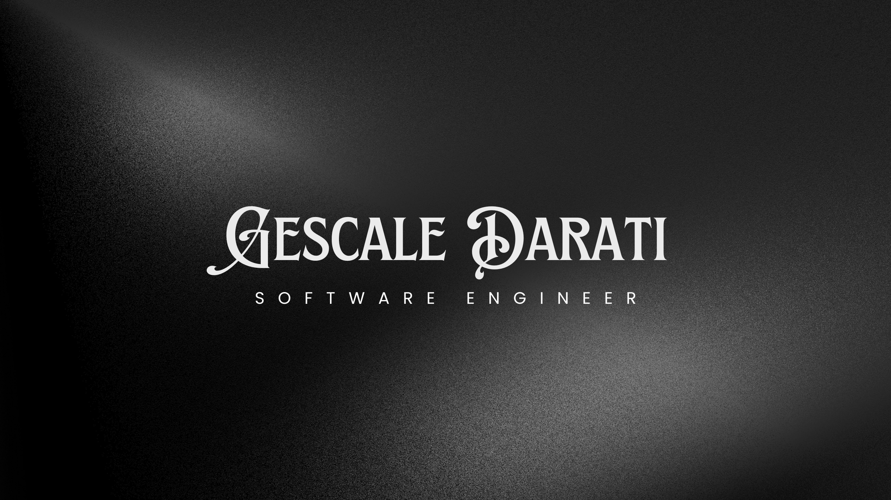

Hi, I'm Gescale Darati
======================

**Software Engineer**

---

### Short Bio
> **I build systems that think fast and fail gracefully | Designing structure out of chaos, one problem at a time.**

---

### About Me

I’m a **Software Engineer** and a **final-year BSc Computing student (Class of 2026)** at the **University of South Africa (UNISA)**.

My primary interest is in **building effective, efficient software systems**, focusing on:
- structure
- performance
- reliability
- and long-term maintainability

I enjoy breaking down complex problem spaces and turning them into **clean, well-designed systems** that scale and adapt over time.

I see software engineering as an exercise in **decision-making and trade-offs**, not just code.

---

### Education
- **BSc in Computing** — University of South Africa (UNISA)  
  *Final year · Expected completion: 2026*

---

### Currently Learning
- **C# and .NET**
- Software Project Management
- Numerical Methods II
- Core **Cloud Computing** concepts and architectures

---

### Databases Experience
- **Oracle SQL**
- **MySQL**
- **MongoDB**

---

### Technical Skills

  
  
  
  
  
  
  
  
  

  
  
  

---

### Connect With Me

  
  
  
  
  <a href="https://gescale.netlify.app/" target="_blank" rel="noreferrer">
    🌐
  </a>

---

### 📊 GitHub Stats

<picture>
  <source media="(prefers-color-scheme: dark)" srcset="https://github-readme-stats.vercel.app/api?username=gescale&show_icons=true&theme=dark">
  <source media="(prefers-color-scheme: light)" srcset="https://github-readme-stats.vercel.app/api?username=gescale&show_icons=true">
  
</picture>

 

<picture>
  <source media="(prefers-color-scheme: dark)" srcset="https://github-readme-stats.vercel.app/api/top-langs/?username=gescale&layout=compact&theme=dark">
  <source media="(prefers-color-scheme: light)" srcset="https://github-readme-stats.vercel.app/api/top-langs/?username=gescale&layout=compact">
  
</picture>

---

### Writing & Knowledge Sharing

I write about **software design, systems thinking, optimisation, and learning in public**.

- **Medium:** [medium.com/@gescale](https://medium.com/@gescale)

Upcoming topics:
- Designing structure out of chaos
- Systems thinking in software engineering
- Failure, resilience, and optimisation
- Learning C++, C#, and system-level programming

---

Thank you for taking the time to visit my profile.  
I’m always open to collaboration, discussion, and learning from others who care about building meaningful systems.
