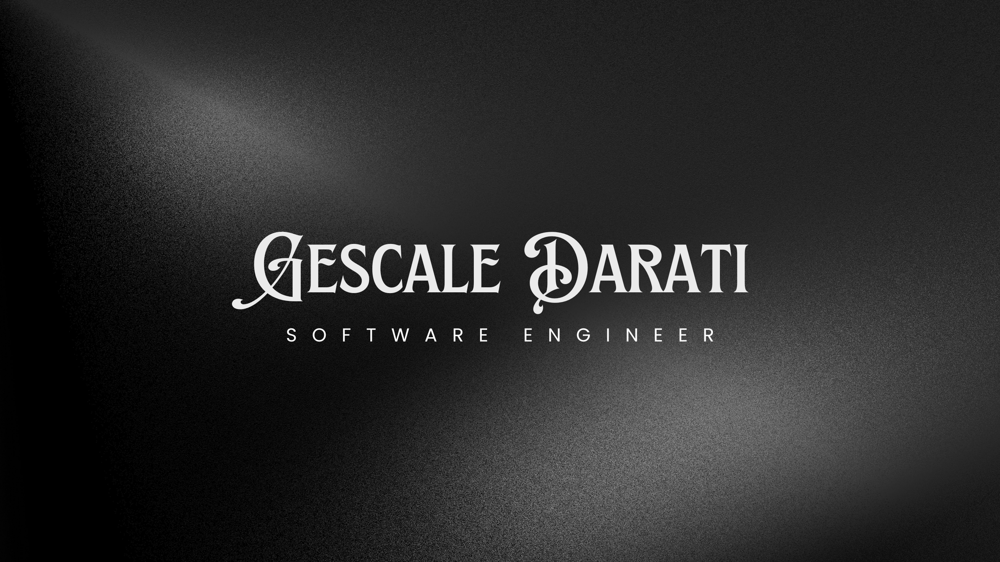

  
  
  

---

### Short Bio
> **I build systems that think fast and fail gracefully | Designing structure out of chaos, one problem at a time.**

---

### Featured Projects
- **[BookStore-UDPListener](https://github.com/Gescale/BookStore-UDPListener)** - Qt6 C++ BookStore management software UDPSockets Listener, receives xml files and displays on the screen.
- **[aspnetcore_api](https://github.com/Gescale/aspnetcore_api)** - A deep-dive into building production-grade APIs using ASP.NET Core 10. It tracks my progress through the "Master RESTful API Development" course, moving from fundamental REST principles to complex security architectures and frontend integration.

---

### Education & Learning
- **BSc in Computing** — University of South Africa (UNISA) *(Final year)*
- **Currently Learning:** C# and .NET, Software Project Management, Numerical Methods II, Core Cloud Computing concepts and architectures.

---

### Technical Skills

* **Languages:** C#, C++, Python, TypeScript, JavaScript (ES6+)
* **Frameworks & Libraries:** ASP.NET Core, React, Node.js, Qt C++
* **Databases:** MS SQL Server, MySQL, Oracle SQL, MongoDB
* **Tools:** Git, Core Cloud Architectures

---

### GitHub Stats

  
  

  

---

### Writing & Knowledge Sharing

I write about **software design, systems thinking, optimisation, and learning in public**.

- **Medium:** [medium.com/@gescale](https://medium.com/@gescale)

---

### Connect With Me

**[GitHub](https://github.com/gescale)** | **[LinkedIn](https://www.linkedin.com/in/gescale/)** | **[Twitter / X](https://x.com/its_gescale)** | **[Medium](https://medium.com/@gescale)** | **[Portfolio Website](https://gescale.netlify.app/)**
